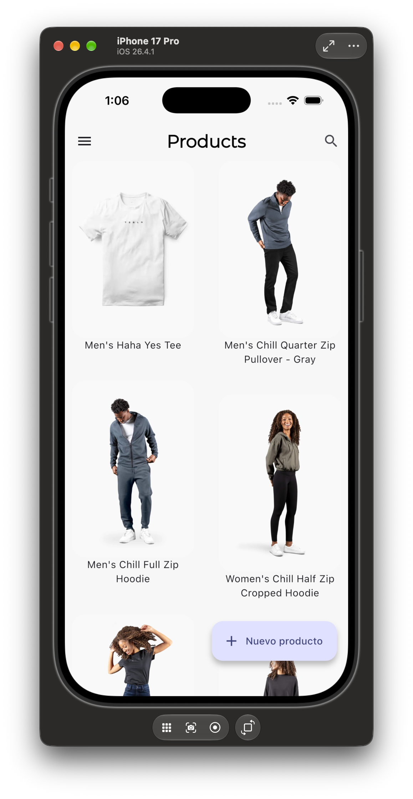

# Flutter Shop Admin - Full Project Overview

<p align="center">
  <a href="https://youtube.com/shorts/OQrZLijUDiA">
    
  </a>
</p>

<p align="center">
  <a href="https://youtube.com/shorts/OQrZLijUDiA">Watch the video demo on YouTube</a>
</p>

## Project Status

**Snapshot updated:** `2026-09-28`  
**Branch:** `main`  
**Last documented commit:** `266da21` - "Agregar archivo InfoPlist.swift para la configuración de la lista de propiedades"  
**Status:** course project completed, with authentication, product catalog, product creation and editing, stock control and photo upload implemented. Further development continues in a separate repository.

## Overview

Flutter Shop Admin is a Flutter app for managing an online store's product catalog and stock. It consumes a NestJS REST API protected with JWT, uses Clean Architecture, Riverpod for state management and Go Router for navigation with authentication-based redirects.

The central technical focus of the app is the **authenticated CRUD flow**: the session token is obtained at login, persisted with `shared_preferences`, checked again at startup and injected into every product request. Product data travels from the API to the UI through datasources, mappers and repositories, and back from a validated form to the API, uploading local photos before saving the product.

## Technologies and Dependencies

**SDK:** Dart `>=2.19.4 <4.0.0` / Flutter (tested with Flutter `3.47.5`)

| Package | Version | Purpose |
|---|---:|---|
| flutter_riverpod | ^2.3.2 | State management with `StateNotifierProvider` |
| go_router | ^6.2.0 | Navigation with `redirect` and `refreshListenable` |
| dio | ^5.0.2 | HTTP client for API requests |
| formz | 0.8.0 | Form input validation |
| image_picker | ^1.2.3 | Camera and gallery photos |
| shared_preferences | ^2.5.5 | Session token persistence |
| flutter_dotenv | ^6.0.1 | `.env` environment variables |
| flutter_staggered_grid_view | ^0.7.0 | `MasonryGridView` for the catalog |
| google_fonts | ^8.2.1 | Montserrat Alternates typography |
| path_provider | ^2.1.5 | System directory lookup |
| flutter_lints | ^2.0.0 | Linting rules |

## Data Source

- **Backend:** [Flutter Shop Admin Backend](https://github.com/RaulEstevezA/Flutter_Shop_Admin_Backend)
- **Base URL:** configured in `.env` as `API_URL` (for example `http://localhost:3000/api`)
- **Authentication:** JWT sent in the `Authorization: Bearer <token>` header
- **Images:** served from `{API_URL}/files/product/{image}`

The app does not pass raw API responses to the UI. `UserMapper` and `ProductMapper` convert JSON into the `User` and `Product` entities. `ProductMapper` also normalizes image names into full URLs, and the product form does the reverse step before saving, sending only the file name back to the API.

### API Endpoints

| Method | Endpoint | Purpose |
|---|---|---|
| `POST` | `/auth/login` | Login with email and password |
| `POST` | `/auth/register` | New user registration |
| `GET` | `/auth/check-status` | Validate the stored token and renew the session |
| `GET` | `/products?limit=&offset=` | Paginated product list |
| `GET` | `/products/{id}` | Product details |
| `POST` | `/products` | Create a product |
| `PATCH` | `/products/{id}` | Update a product, including its stock |
| `POST` | `/files/product` | Upload a product image (`multipart/form-data`) |

### Error Handling

| Case | Result |
|---|---|
| `401` at login | Backend message or "Credenciales incorrectas" |
| `400` at registration | Validation messages from the backend, joined when they come as a list |
| Connection timeout | "Revisar conexión a internet" |
| `401` when checking the token | Session closed and redirect to login |
| `404` when loading a product | `ProductNotFound` exception |

## Architecture

The project is organized by feature, and each feature follows Clean Architecture:

```text
lib/
├── config/
│   ├── constants/        # Environment: loads .env and exposes API_URL
│   ├── router/           # GoRouter + GoRouterNotifier (auth-based redirects)
│   └── theme/            # Material 3, seed color #424CB8, Montserrat Alternates
└── features/
    ├── auth/
    │   ├── domain/           # User entity, datasource and repository contracts
    │   ├── infrastructure/   # AuthDataSourceImpl (Dio), UserMapper, custom errors
    │   └── presentation/     # authProvider, login/register forms and screens
    ├── products/
    │   ├── domain/           # Product entity, datasource and repository contracts
    │   ├── infrastructure/   # ProductsDatasourceImpl, ProductMapper, ProductNotFound
    │   └── presentation/     # Providers, catalog screen, editor and ProductCard
    └── shared/
        ├── infrastructure/
        │   ├── inputs/       # Formz inputs: Email, Password, Title, Slug, Price, Stock...
        │   └── services/     # CameraGalleryService and KeyValueStorageService
        └── widgets/          # SideMenu, CustomProductField, FullScreenLoader...
```

### Authenticated Data Flow

- `AuthNotifier` logs in or registers through `AuthRepository` and stores the token with `KeyValueStorageService`.
- `productsRepositoryProvider` watches `authProvider` and builds `ProductsDatasourceImpl` with the current user's token, so every Dio request carries the `Bearer` header.
- Datasources call the API, mappers turn JSON into entities and repositories expose clean methods to the providers.
- Riverpod providers consume the repositories and deliver ready-to-render state to the UI.

## Domain Entities

| Entity | Fields |
|---|---|
| User | `id`, `email`, `fullName`, `roles`, `token` (plus the `isAdmin` getter) |
| Product | `id`, `title`, `price`, `description`, `slug`, `stock`, `sizes`, `gender`, `tags`, `images`, `user` |

## Implemented Features

### 1. Authentication

`CheckAuthStatusScreen` is the initial route (`/splash`) and shows a loader while `AuthNotifier.checkAuthStatus()` reads the stored token and validates it against `/auth/check-status`.

- **Login** (`/login`): email and password validated with Formz. It submits with the button or from the keyboard.
- **Registration** (`/register`): full name (minimum 3 characters), email, password (minimum 6 characters, with uppercase, lowercase and a number or symbol) and password confirmation. Confirmation is checked again whenever the password changes.
- While the form is submitting, the button is disabled (`isPosting`).
- Backend errors are shown in a `SnackBar`.
- **Logout** from the side menu: the token is removed and the router returns to login.

### 2. Auth-Based Navigation

`GoRouterNotifier` is a `ChangeNotifier` that listens to `AuthNotifier` and is used as the router's `refreshListenable`. The `redirect` function applies these rules:

| Status | Behavior |
|---|---|
| `checking` | Stays on `/splash` |
| `notAuthenticated` | Only `/login` and `/register` are allowed; any other route redirects to `/login` |
| `authenticated` | `/login`, `/register` and `/splash` redirect to `/` |

### 3. Product Catalog

`ProductsScreen` renders the products in a 2-column `MasonryGridView`. Each `ProductCard` shows the first image with `FadeInImage` (using an animated loader as the placeholder) and the product name; if there are no images, it uses `assets/images/no-image.jpg`.

Pagination is infinite: the `ScrollController` calls `loadNextPage()` when the scroll is 400 px from the end. `ProductsNotifier` requests pages of 10 products and uses `isLoading` and `isLastPage` guards to avoid duplicated requests.

Tapping a product opens `/product/:id`, and the "Nuevo producto" button opens `/product/new` to create one.

### 4. Product Editor

`ProductScreen` loads the product with `productProvider` (`StateNotifierProvider.autoDispose.family`) and builds the form with `productFormProvider`, which receives the `Product` as its family parameter.

| Field | Validation |
|---|---|
| Name (`Title`) | Required |
| Slug | Required, no spaces or apostrophes |
| Price | Number greater than or equal to 0 |
| Stock ("Existencias") | Integer greater than or equal to 0 |
| Sizes | Multiple selection with `SegmentedButton` (XS, S, M, L, XL, XXL, XXXL) |
| Gender | Single selection with icons (men, women, kid) |
| Description | Multiline free text |
| Tags | Comma-separated text |

The save button marks every field as touched, checks the form validity and calls `ProductsNotifier.createOrUpdateProduct()`. If the product already exists in the list, it is replaced; if not, it is added. A `SnackBar` confirms the save.

### 5. Stock Control

Stock is the key inventory field of each product:

- It is shown and edited in the "Existencias" field of the editor.
- The `Stock` input (Formz) rejects empty, non-numeric and negative values, and the error message appears under the field.
- On save, the value is sent as `stock` in the `PATCH /products/{id}` request, and the edited product replaces the old one in `productsProvider`, so the catalog keeps the new quantity without reloading.

### 6. Product Photos

The editor's app bar has two buttons:

- **Gallery** (`selectPhoto`) and **camera** (`takePhoto`, rear camera), both through `CameraGalleryServiceImpl` using `image_picker` at 80% quality.
- New photos are added to the form and shown immediately in the `PageView` gallery (`FileImage` for local files, `NetworkImage` for remote ones).
- On save, `ProductsDatasourceImpl` separates new photos (local paths) from existing ones, uploads the new ones in parallel with `Future.wait` to `/files/product` and sends the final list of names to the API.

### 7. Localized Permissions (iOS)

The camera, photo library and microphone permission prompts have their descriptions in `Info.plist` (English) and in `InfoPlist.strings` for `en` and `es`, so they are shown in the device language.

## State Management

| Provider | Type | Purpose |
|---|---|---|
| authProvider | StateNotifierProvider<AuthNotifier, AuthState> | Auth status, current user and error messages |
| loginFormProvider | StateNotifierProvider.autoDispose | Login form state |
| registerFormProvider | StateNotifierProvider.autoDispose | Registration form state |
| goRouterNotifierProvider | Provider<GoRouterNotifier> | Bridge between authentication and the router |
| goRouterProvider | Provider<GoRouter> | Router configuration |
| productsRepositoryProvider | Provider<ProductsRepository> | Repository with the current user's token |
| productsProvider | StateNotifierProvider<ProductsNotifier, ProductsState> | Paginated catalog and create/update |
| productProvider | StateNotifierProvider.autoDispose.family<…, String> | Loads a product by ID (or an empty one for `new`) |
| productFormProvider | StateNotifierProvider.autoDispose.family<…, Product> | Product form with validation |

## Navigation

| Route | Screen | Access |
|---|---|---|
| `/splash` | `CheckAuthStatusScreen` | Initial route while the session is checked |
| `/login` | `LoginScreen` | Unauthenticated only |
| `/register` | `RegisterScreen` | Unauthenticated only |
| `/` | `ProductsScreen` | Authenticated |
| `/product/:id` | `ProductScreen` | Authenticated; `new` creates an empty product |

## Platform Configuration

| Platform | Configuration |
|---|---|
| iOS | Minimum deployment target `15.0`; plugins through Swift Package Manager (no CocoaPods) |
| Android | Gradle `9.1.0`, Android Gradle Plugin `9.0.1`, Kotlin `2.3.20` with AGP built-in Kotlin |

## Setup

1. Start the [backend](https://github.com/RaulEstevezA/Flutter_Shop_Admin_Backend) by following the instructions in its repository.
2. Copy `.env.template` to `.env` and set the URL:

```env
API_URL=http://localhost:3000/api
```

> On the Android emulator, use `http://10.0.2.2:3000/api`.

3. Install dependencies:

```bash
flutter pub get
```

4. Run the app:

```bash
flutter run
```

## Main README

[Link to the main README.md](./README.md)
